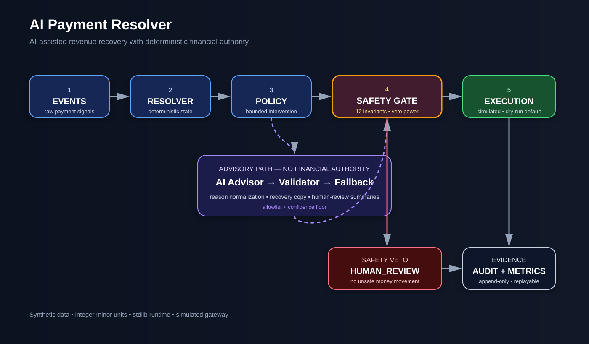
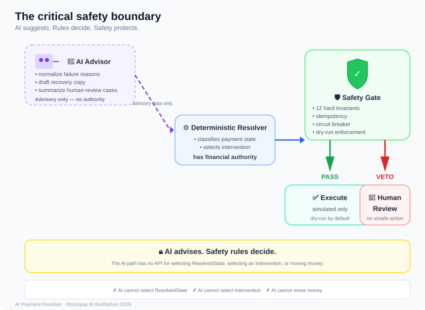

# AI-Payment-Resolver

> Deterministic payment-state resolution and bounded revenue recovery with fail-closed safety controls.

AI Payment Resolver turns ambiguous payment event streams into a deterministic payment state, a bounded recovery decision, and an append-only audit trail. The system separates financial authority from explanation: deterministic rules classify payment state and select interventions, a safety gate vetoes unsafe actions, and an AI layer provides advisory-only explanations, recovery copy, and human-review summaries. Money movement is simulated by default and requires an explicit `--execute` flag.

## Problem

Payment and checkout systems emit event streams that arrive out of order, duplicated, or contradictory. A webhook can arrive late, twice, with the wrong amount, or contradict another event. Operating on a guessed state is dangerous: re-charging a customer who already paid, double-capturing, or double-refunding causes direct financial loss and compliance exposure.

Today this is handled manually by operations teams after the money is already gone. The gap is not detecting the failure — it is deciding what to do next without making the financial situation worse.

## Solution

AI Payment Resolver closes that gap by deterministically resolving payment state from raw events, detecting revenue at risk, selecting a bounded recovery action, and executing or safely simulating it within hard guardrails — with a full audit trail.

The system processes each order through an ordered, deterministic pipeline:

1. **Ingest** — accept a stream of payment/checkout events for one order.
2. **Normalize** — deduplicate by event id, stable-sort by occurrence time, flag out-of-order arrival.
3. **Resolve state** — apply a deterministic rule table to produce exactly one `ResolvedState` plus a `rule_trace`.
4. **Detect risk** — classify whether revenue is at risk and identify the root cause.
5. **Decide intervention** — map `ResolvedState` to exactly one bounded `Intervention`.
6. **Safety gate** — run twelve invariant checks; any failure vetoes the action and downgrades to `HUMAN_REVIEW`.
7. **Execute or simulate** — perform the action against a simulated gateway in dry-run by default; `--execute` is required for any money movement.
8. **Record** — append one immutable `DecisionRecord` to the audit trail.
9. **Aggregate** — accumulate metrics across the batch.

State resolution is a pure function with no I/O, no clock, and no randomness — all time and configuration are injected — so it is exhaustively testable.

## System Architecture



## How It Works


The system classifies payments into one of seven terminal states:

| State | Meaning |
|---|---|
| `NORMAL_SUCCESS` | Payment completed normally |
| `NORMAL_FAILURE` | Terminal failure / no successful payment |
| `PENDING_PAYMENT` | Payment remains unresolved/in-flight |
| `LATE_AUTHORIZATION` | Authorization arrived outside the configured window |
| `DUPLICATE_PAYMENT` | More than one successful payment exists for one order |
| `ORDER_PAYMENT_MISMATCH` | Amount or currency does not reconcile |
| `HUMAN_REVIEW` | Evidence is contradictory, unsafe, or requires intervention |

Each state maps to exactly one bounded intervention. Only two interventions may move money, and both pass the full safety gate.

## AI Boundary

AI is advisory-only. It can read events and emit a structured advisory, but it **cannot** select a payment state, choose an intervention, authorize a refund, move money, bypass safety checks, override deterministic rules, bypass idempotency, or change the audit trail.

AI may:
- **Explain outcomes** — normalize failure reasons and summarize resolution evidence.
- **Draft recovery communication** — generate bounded customer-facing retry/nudge text.
- **Assist human review** — produce concise case summaries with suggested next steps for escalated orders.

AI must NOT:
- select `ResolvedState`
- select `Intervention`
- authorize refunds or captures
- move money
- bypass safety checks
- override deterministic rules
- bypass idempotency
- change the audit trail

The default AI provider is an offline deterministic stub (no API key, no network). A real LLM is an optional drop-in behind the same interface. All AI output passes through a validator that enforces an allowlist and a confidence floor (`0.7`). Invalid or low-confidence output falls back to deterministic defaults.

## Safety Model

The safety gate has **veto authority** over every money-moving action.

```
Payment Events
       ↓
Deterministic State Resolution
       ↓
Risk Assessment
       ↓
Intervention Proposal
       ↓
Safety Gate (12 invariants)
       ↓
Bounded Action / Human Review / No Action
       ↓
Append-Only Audit Record
```



The safety gate enforces twelve tested invariants covering:
- amount bounds
- currency consistency
- authorization/capture relationships
- late-authorization windows
- duplicate handling
- idempotency
- recovery-link limits
- dry-run behavior
- circuit-breaker behavior
- AI confidence validation
- and other execution constraints

If any safety check fails, the action fails closed and escalates to `HUMAN_REVIEW`. No unsafe money movement occurs.

**Dry-run execution:** Money actions require an explicit `--execute` flag. The default run is dry-run only.

**Idempotency:** Every decision carries a stable idempotency key. Replay of the same audit trail produces zero duplicate money actions.

**Append-only audit:** Each decision becomes a `DecisionRecord` in JSONL with resolution, intervention, safety results, AI advisory data, signals, and execution information. The trail is immutable and replayable.

## Batch Evidence

The included dataset contains **210 verified tests** across **50 deterministic synthetic orders** spanning scenario families S1–S12.

Latest verified run (dry-run):

| Metric | Verified result |
|---|---:|
| Orders | 50 |
| Total value | ₹37,81,320 |
| Captured | ₹37,55,550 |
| Refunded | ₹4,000 |
| Revenue at risk | ₹21,770 |
| Safety exceptions | 5 |
| Dry-run blocks | 10 |
| Human review count | 25 |
| Human review value | ₹37,64,150 |
| Accounting identity | **PASS** |

These results come from 50 deterministic synthetic payment orders. The resolver accounted for ₹37,81,320 in total transaction value, while keeping payment decisions deterministic and auditable. Human review was triggered for 25 orders worth ₹37,64,150, and the accounting identity passed.

> Money is stored internally as integer paise for deterministic accounting; documentation displays amounts in Indian Rupees for readability.

### Intervention distribution

```
ESCALATE_HUMAN_REVIEW   25
NO_ACTION                9
SEND_RECOVERY_LINK       6
RECONCILE_PENDING        5
REFUND_DUPLICATE         5
```

### Idempotency verification

Replaying the audit trail produces:

```
Blocked (idempotent): 50
New actions:           0
PASS: All actions idempotent
```

No duplicate money movement.

## Scenario Walkthrough

### Duplicate payment (ORD-S6-001)

```powershell
python -m backend.cli explain --scenario ORD-S6-001
```

Demonstrates `DUPLICATE_PAYMENT` resolution, `REFUND_DUPLICATE` intervention, AI recovery copy, and safety-gate dry-run protection.

### Contradictory evidence (ORD-S9-001)

```powershell
python -m backend.cli explain --scenario ORD-S9-001
```

Demonstrates `HUMAN_REVIEW` escalation, contradictory evidence handling, AI human-review summary, and fail-closed handling of ambiguous evidence.

## Project Walkthrough & Technical Demonstration

A complete 5:17 walkthrough of AI-Payment-Resolver, demonstrating the system architecture, deterministic payment-state resolution, safety controls, AI advisory layer, batch evidence, and dry-run execution.

**▶ [Watch the Project Walkthrough](https://drive.google.com/file/d/1ajgVmXaYCO-b-EOuyuFwAiTdTHaLQBrN/view?usp=sharing)**

- Duration: 5:17
- Resolution: 4K
- Data: Synthetic payment scenarios
- Execution: Dry-run only

## Quickstart

### Requirements

- Python 3.14+
- `pytest` for the test suite
- No runtime third-party dependencies

### Install

```powershell
git clone https://github.com/ERANNA2427/AI-Payment-Resolver.git
cd AI-Payment-Resolver

python -m venv .venv
.\.venv\Scripts\Activate.ps1

python -m pip install -r requirements.txt
```

### Run tests

```powershell
python -m pytest backend/tests/ -q
```

Expected:

```text
210 passed
```

### Run the batch demo

```powershell
python -m backend.cli run `
  --batch data/scenarios.jsonl `
  --audit runs/demo/final-audit.jsonl
```

**Dry-run is the default.**

### Generate the report

```powershell
python -m backend.cli report `
  --audit runs/demo/final-audit.jsonl
```

### Verify replay safety

```powershell
python -m backend.cli replay `
  --audit runs/demo/final-audit.jsonl
```

Expected:

```text
Blocked (idempotent): 50
New actions: 0
PASS: All actions idempotent
```

Money movement is simulated only. `--execute` is required even for the simulated execution path.

## Project Structure

```
AI-Payment-Resolver/
├── backend/
│   ├── ai/
│   │   ├── advisor.py
│   │   ├── stub_advisor.py
│   │   └── validator.py
│   ├── resolvers/
│   │   └── payment_state_resolver.py
│   ├── audit.py
│   ├── cli.py
│   ├── events.py
│   ├── execution.py
│   ├── metrics.py
│   ├── models.py
│   ├── resolver.py
│   ├── rules.py
│   ├── safety.py
│   └── tests/
├── data/
│   └── scenarios.jsonl
├── docs/
│   ├── architecture.svg
│   ├── AI_SAFETY.md
│   ├── batch-evidence.svg
│   ├── DEMO.md
│   ├── hero.svg
│   ├── how-it-works.svg
│   ├── merchant-how-it-works.svg
│   ├── merchant-payment-flow.svg
│   └── safety-boundary.svg
├── .github/workflows/ci.yml
├── ARCHITECTURE.md
├── PROJECT_SPEC.md
├── CONTRIBUTING.md
├── SECURITY.md
├── pyproject.toml
├── requirements.txt
└── README.md
```

## Razorpay AI Revenue Recovery Alignment

Built as a submission for the **Razorpay AI Buildathon — AI Revenue Recovery** track.

The project maps to the track requirements:

| Track requirement | Implementation |
|---|---|
| Detect revenue at risk | Deterministic state resolution identifies `NORMAL_FAILURE`, `PENDING_PAYMENT`, `LATE_AUTHORIZATION`, `DUPLICATE_PAYMENT`, `ORDER_PAYMENT_MISMATCH`, and `HUMAN_REVIEW` states |
| Determine appropriate intervention | Policy layer maps each state to exactly one bounded `Intervention` |
| Execute bounded recovery workflow | Safety gate enforces 12 invariants before any money-moving action; dry-run is the default |
| Measured batch evidence | 50 synthetic scenarios with verified metrics and accounting identity |
| Compliant / human escalation | 12 safety invariants, fail-closed design, `ESCALATE_HUMAN_REVIEW` for all ambiguous or unsafe cases |
| Stopping rules | Circuit breaker halts money actions when batch exception rate exceeds threshold |
| Audit trail | Append-only JSONL with idempotency keys, rule traces, safety results, and replay verification |

## Engineering Principles

- **Deterministic authority** — State resolution, policy mapping, and safety checks are deterministic with injected time and configuration. Safety evaluation bookkeeping is isolated and does not alter resolution or policy outcomes.
- **Advisory-only AI** — AI explains, summarizes, and drafts copy. It never selects state, chooses intervention, or moves money.
- **Fail-closed safety** — Any safety violation vetoes the action and escalates to human review. The system never tries to be clever with money.
- **Integer money** — All amounts are integer minor units (paise). No floating-point arithmetic.
- **Idempotent execution** — Stable idempotency keys ensure replay produces zero duplicate money actions.
- **Synthetic data only** — The dataset contains deterministic synthetic scenarios. No real customer payments are processed.
- **Stdlib-only runtime** — Python 3.14 standard library only at runtime. `pytest` is the only external dependency.

## License

No open-source license has been declared yet. The repository is intended for buildathon evaluation.

---

<p align="center">
  <strong>AI can recommend. Safety decides whether anything is allowed to happen.</strong>
</p>
