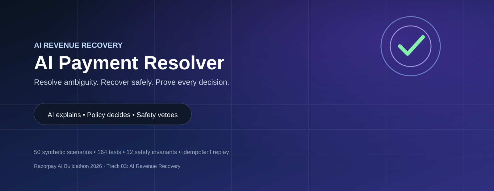
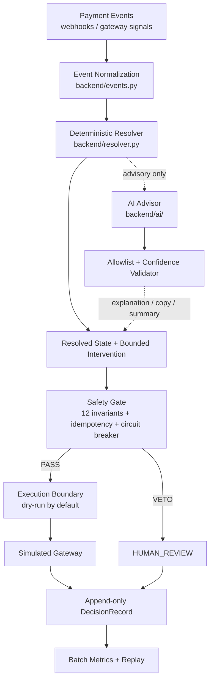
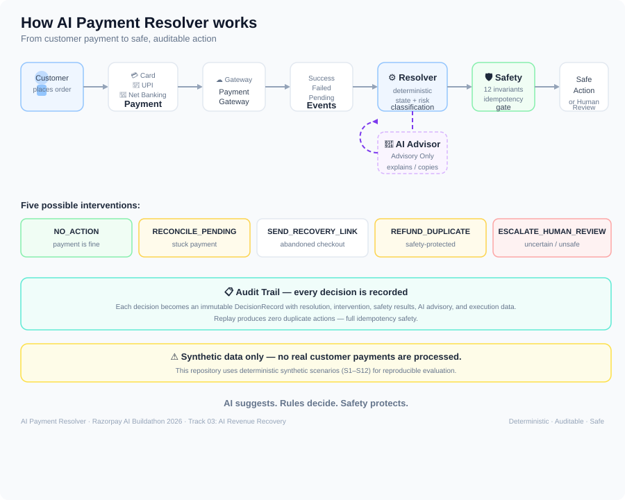
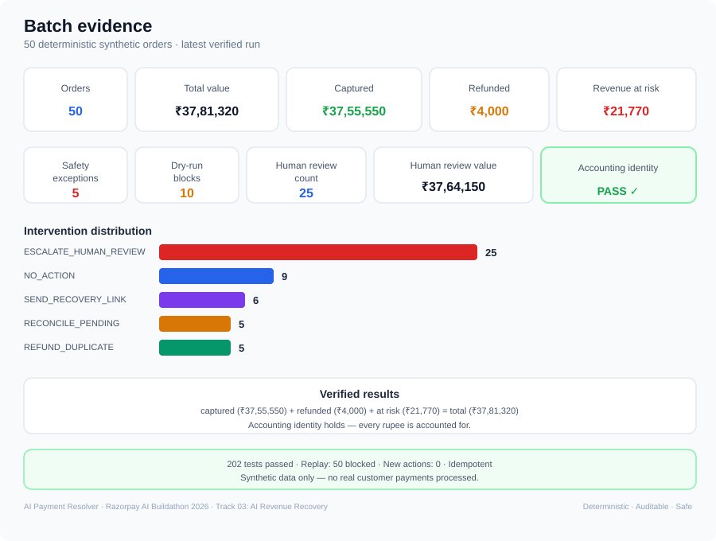

# AI Payment Resolver

<p align="center">
  
</p>

<p align="center">
  <strong>AI-assisted payment state resolution and bounded revenue recovery</strong><br>
  Deterministic decisions • Fail-closed safety • Idempotent recovery • Audit-ready evidence
</p>

<p align="center">
  
  
  
  
  
</p>

> **Razorpay AI Buildathon 2026 — Track 03: AI Revenue Recovery**

## The one-line idea

**Don't let an ambiguous payment event become an unsafe payment action.**

AI Payment Resolver turns messy, delayed, duplicated, contradictory payment events into a deterministic payment state, a bounded recovery decision, and an immutable audit record — while a separate safety gate can veto every money-moving action.

---

## Why this problem matters

Payment failure is rarely a single clean event.

A payment can be:

- authorized after the expected window,
- captured twice,
- reported with the wrong amount or currency,
- stuck in pending,
- accompanied by contradictory webhooks,
- abandoned after checkout,
- or surrounded by noisy gateway error messages.

A naive recovery agent can make the situation worse by retrying blindly, refunding the wrong payment, or acting on an incorrect state.

This project separates **reasoning** from **authority**.

### Core principle

```text
AI may explain.
Deterministic policy decides.
Safety may veto.
Only the execution boundary can act.
```

---

## What is actually built

### 1. Deterministic payment-state resolver

Maps normalized payment events to one of seven states:

| State | Meaning |
|---|---|
| `NORMAL_SUCCESS` | Payment completed normally |
| `NORMAL_FAILURE` | Terminal failure / no successful payment |
| `PENDING_PAYMENT` | Payment remains unresolved/in-flight |
| `LATE_AUTHORIZATION` | Authorization arrived outside the configured window |
| `DUPLICATE_PAYMENT` | More than one successful payment exists for one order |
| `ORDER_PAYMENT_MISMATCH` | Amount/currency does not reconcile |
| `HUMAN_REVIEW` | Evidence is contradictory, unsafe, or requires intervention |

### 2. Bounded interventions

The policy layer maps states to a constrained set of interventions.

Money-moving actions are deliberately narrow. High-risk or ambiguous cases are escalated.

### 3. AI advisory layer

The AI layer is **not the decision maker**.

It can:

- normalize failure reasons,
- draft recovery copy,
- summarize human-review cases.

Its output is validated by an allowlist and confidence floor. Invalid or low-confidence output falls back to a deterministic result.

### 4. Safety gate

The safety gate has veto power.

It enforces 12 tested safety invariants covering:

- amount bounds,
- currency consistency,
- authorization/capture relationships,
- late-auth windows,
- duplicate handling,
- idempotency,
- recovery-link limits,
- dry-run behavior,
- circuit-breaker behavior,
- AI confidence validation,
- and other execution constraints.

**If a safety check fails, the action fails closed and escalates to human review.**

### 5. Idempotent execution

Every decision carries an idempotency key.

Replay of the same audit trail produces:

```text
Blocked (idempotent): 50
New actions:           0
```

No duplicate money movement.

### 6. Append-only audit trail

Each decision becomes a `DecisionRecord` in JSONL with resolution, intervention, safety results, AI advisory data, signals, and execution/economic information.

---

# Architecture



A higher-resolution architecture diagram is available at [`docs/architecture.svg`](docs/architecture.svg).

---

# The critical safety boundary

```text
                    ┌───────────────────────┐
                    │      AI ADVISOR       │
                    │  explain / summarize  │
                    │  draft recovery copy  │
                    └───────────┬───────────┘
                                │
                         advisory data
                                ▼
┌──────────────┐      ┌───────────────────────┐
│ DETERMINISTIC│ ───► │     SAFETY GATE       │
│   RESOLVER   │      │  12 hard invariants   │
└──────────────┘      │  idempotency          │
                      │  circuit breaker       │
                      │  dry-run enforcement   │
                      └───────┬───────┬────────┘
                              │       │
                           PASS│       │VETO
                              ▼       ▼
                         EXECUTE   HUMAN REVIEW
                         (simulated)
```

**The AI path has no API for selecting `ResolvedState`, selecting an `Intervention`, or moving money.**

---

# How it works

The system processes a customer payment, resolves its true state with deterministic rules, asks the AI only for explanation and copy, then a safety gate decides whether any money-moving action is allowed. Every decision is written to an append-only audit trail.



> This repository runs on **deterministic synthetic data**. No real customer payments are processed.

---

# Batch evidence

The included dataset contains **50 deterministic synthetic orders across S1–S12**.



Latest verified run:

| Metric | Verified result |
|---|---:|
| Orders | 50 |
| Total value | ₹37,81,320 |
| Captured | ₹37,55,550 |
| Refunded | ₹4,000 |
| Revenue at risk | ₹21,770 |
| Safety exceptions | 5 |
| Dry-run blocks | 10 |
| Human review count | 25 |
| Human review value | ₹37,64,150 |
| Accounting identity | **PASS** |

These results come from 50 deterministic synthetic payment orders. The resolver accounted for ₹37,81,320 in total transaction value, while keeping payment decisions deterministic and auditable. Human review was triggered for 25 orders worth ₹37,64,150, and the accounting identity passed.

> Money is stored internally as integer paise for deterministic accounting; the README displays amounts in Indian Rupees for readability.

### Intervention distribution

```text
ESCALATE_HUMAN_REVIEW   25
NO_ACTION                9
RECONCILE_PENDING        5
REFUND_DUPLICATE         5
SEND_RECOVERY_LINK       6
```

### Test evidence

```text
202 passed in 5.51s
```

---

# Quickstart

## Requirements

- Python 3.14+
- `pytest` for the test suite
- No runtime third-party dependencies

## Install

```powershell
git clone https://github.com/ERANNA2427/AI-Payment-Resolver.git
cd AI-Payment-Resolver

python -m venv .venv
.\.venv\Scripts\Activate.ps1

python -m pip install -r requirements.txt
```

## Verify the system

```powershell
python -m pytest backend/tests/ -q
```

Expected:

```text
202 passed
```

## Run the batch demo

```powershell
python -m backend.cli run `
  --batch data/scenarios.jsonl `
  --audit runs/demo/final-audit.jsonl
```

**Dry-run is the default.**

## Generate the report

```powershell
python -m backend.cli report `
  --audit runs/demo/final-audit.jsonl
```

## Verify replay safety

```powershell
python -m backend.cli replay `
  --audit runs/demo/final-audit.jsonl
```

Expected:

```text
Blocked (idempotent): 50
New actions: 0
PASS: All actions idempotent
```

Money movement is simulated only. `--execute` is required even for the simulated execution path.

---

# Repository map

```text
AI-Payment-Resolver/
├── backend/
│   ├── ai/
│   │   ├── advisor.py
│   │   ├── stub_advisor.py
│   │   └── validator.py
│   ├── resolvers/
│   │   └── payment_state_resolver.py
│   ├── audit.py
│   ├── cli.py
│   ├── events.py
│   ├── execution.py
│   ├── metrics.py
│   ├── models.py
│   ├── resolver.py
│   ├── rules.py
│   ├── safety.py
│   └── tests/
├── data/
│   └── scenarios.jsonl
├── docs/
│   ├── architecture.svg
│   ├── AI_SAFETY.md
│   └── DEMO.md
├── ARCHITECTURE.md
├── PROJECT_SPEC.md
├── README.md
├── pyproject.toml
└── requirements.txt
```

---

# Design choices

### Stdlib-only runtime

No framework or LLM SDK is required to run the core system. The default AI provider is an offline deterministic stub.

This makes the demo reproducible and removes network/API-key dependencies.

### Integer money

Amounts are represented as integer minor units.

**No floating-point money arithmetic.**

### Pure resolution

The resolver is deterministic with injected time/configuration.

That makes the state decision testable and replayable.

### Fail closed

Safety violations do not silently continue.

```text
safety failure
      ↓
HUMAN_REVIEW
      ↓
no unsafe money movement
```

### Synthetic data only

`data/scenarios.jsonl` contains synthetic scenarios. No real customer/payment data is included.

---

# What broke — and how it was fixed

During development, the audit CLI exposed an important production-style issue:

**Repeated `run --audit PATH` calls append to the immutable JSONL audit trail.**

The first report was correct, but a later report could double-count logical decisions if every physical record was treated as unique.

The fix preserved append-only writes and added **idempotency-key deduplication at report/replay read time**.

Regression coverage now protects this behavior.

This is intentionally documented because reliable systems are not defined by never failing; they are defined by how failures are detected, contained, and corrected.

---

# Demo

The 5-minute walkthrough is documented in [`docs/DEMO.md`](docs/DEMO.md).

Recommended story:

1. Start with an ambiguous payment.
2. Show deterministic resolution.
3. Show AI explanation without AI authority.
4. Show the safety gate vetoing unsafe action.
5. Show bounded recovery / simulated execution.
6. Show batch economics and exceptions.
7. Replay the same audit trail and prove zero duplicate actions.

---

# Track alignment

**Razorpay AI Buildathon — AI Revenue Recovery**

This project is designed around the track's central loop:

```text
Detect revenue at risk
        ↓
Diagnose the payment state
        ↓
Choose a bounded intervention
        ↓
Apply safety constraints
        ↓
Execute only when permitted
        ↓
Record the decision
        ↓
Measure recovery + exceptions
```

The important distinction is that **AI is used where uncertainty and communication benefit from it, while financial authority remains deterministic and policy-controlled.**

---

# Status

**Demo-ready**

- 202 tests passing
- 50 synthetic batch scenarios
- 7 resolved states
- 9 intervention types
- 12 safety invariants
- AI advisory boundary
- append-only audit trail
- accounting identity verification
- idempotent replay
- dry-run by default
- simulated execution only

---

## License

No open-source license has been declared yet. The repository is intended for buildathon evaluation.

---

<p align="center">
  <strong>AI can recommend. Safety decides whether anything is allowed to happen.</strong>
</p>
